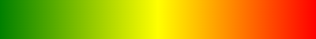
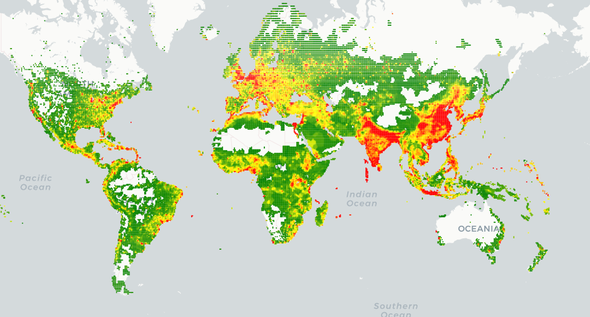
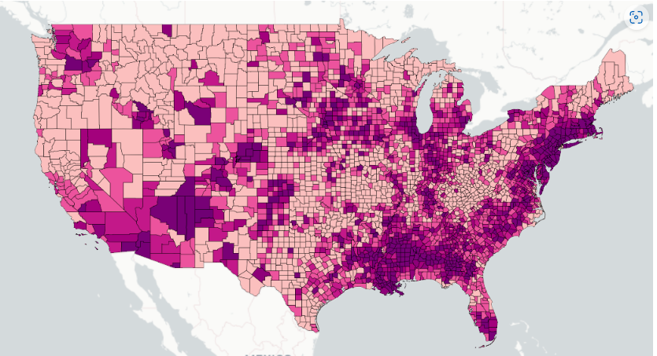
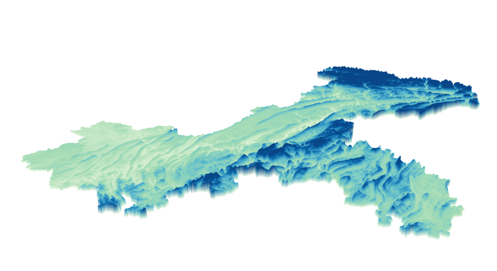

# colorin

colors interpolate  



## gallery




## Examples

[base](https://maptalks.github.io/colorin/test/base.html)  
[pie](https://maptalks.github.io/colorin/test/pie.html)  
[maptalks points](https://maptalks.github.io/colorin/test/mtk-points.html)  
[maptalks lines](https://maptalks.github.io/colorin/test/mtk-lines.html)  
[maptalks polygons](https://maptalks.github.io/colorin/test/mtk-polygons.html)  
[zoom stops](https://maptalks.github.io/colorin/test/zoomstop.html)  
[custom imagedata size](https://maptalks.github.io/colorin/test/customsize.html)  
[covid-19 usa](https://maptalks.github.io/colorin/test/covid-19.html)  
- maptalks.js already has this feature built-in
[maptalks funtion-type demo](https://maptalks.org/examples/en/style/color-interpolate/#style_color-interpolate)

## Install

* CDN

```html
<script src="https://unpkg.com/colorin/dist/colorin.js"></script>
```

* NPM

```sh
npm i colorin
# or
yarn add colorin
```

### Warning

in nodejs, you need  dynamic registerCanvas,you can use [@napi-rs/canvas](https://github.com/Brooooooklyn/canvas) or [node-canvas](https://github.com/Automattic/node-canvas)

```sh
npm i @napi-rs/canvas
# or
yarn add @napi-rs/canvas
```

```js
const {
    ColorIn,
    registerCanvas
} = require('colorin');
const {
    createCanvas
} = require('@napi-rs/canvas');
const canvas = createCanvas(1, 1);
registerCanvas(canvas);
```

## API

### `ColorIn` class

#### constructor(colors, [options])

  + colors `Color collection`

```js
import {
    ColorIn
} from 'colorin';

const colors = [
    [0, '#226412'],
    [2, '#4C931B'],
    [4, '#80BD3F'],
    [6, '#B9E287'],
    [8, '#E7F5D1'],
    [10, '#F7F7F7'],
    [13, '#226412'],
    [16, '#80BD3F'],
    [18, '#F1B7DB'],
    [22, '#DF78AF'],
    [24, '#C6147E'],
    [26, '#8F0051']
];
const ci = new ColorIn(colors);
const [r, g, b, a] = ci.getColor(11);

//if you use cdn
const ci = new colorin.ColorIn(colors);
```

####  method

  + getColor(stop) `get color by stop`

```js
const [r, g, b, a] = ci.getColor(11);
```

  + getImageData() `get canvas image data`

```js
    const imgData = ci.getImageData();
```

    
